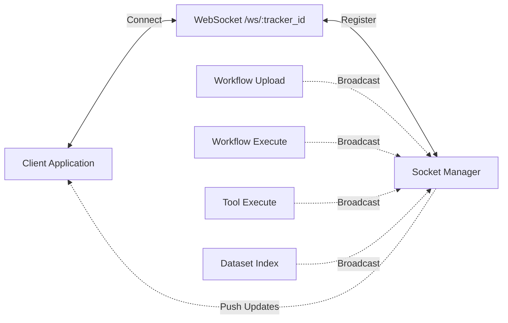

## WebSocket Real-Time Communication

Real-time event broadcasting for long-running Galaxy operations via WebSocket connections.


### Overview

The API provides WebSocket support for tracking progress of asynchronous operations including workflow uploads, workflow executions, tool executions, and dataset indexing. Clients connect to tracker-specific rooms to receive real-time status updates.

#### Architecture



**Key Components**:
- **WebSocket Endpoint**: `/ws/{tracker_id}` - Connection point for real-time updates
- **Socket Manager**: Singleton managing tracker rooms and client connections
- **Event Broadcasters**: Endpoints and background tasks emit events to rooms

### Connection Flow

#### Establish Connection

**Endpoint**: `ws://the-domain/ws/{tracker_id}`

**Parameters**:
- `tracker_id` (path): Unique identifier for tracking room.

**Authentication**: None required for WebSocket endpoint (authentication handled at REST API level)


## Message Structure

All WebSocket messages follow a consistent format:

```typescript
interface WebSocketMessage {
  event: "ping" | "workflow_upload" | "workflow_execute" | "tool_execute" | "output_index";
  data: {
    type?: string;  // Message type enum value
    payload?: any;  // Event-specific payload
  };
}
```

## Endpoint-Specific Events

### 1. Workflow Upload (`workflow_upload`)

```json
{
  "event": "workflow_upload",
  "data": {
    "type": "UPLOAD_WORKFLOW | TOOL_INSTALL | UPLOAD_COMPLETE | UPLOAD_FAILURE",
    "payload": {
      "message": "Short status description"
    }
  }
}
```
---

### 2. Workflow Execution (`workflow_execute`)

Payload structure varies by type:
- Progress: job/step counters  
- Completion: final message + counts  
- Failure: message + optional details (e.g., `failed_step_id`)

```json
{
  "event": "workflow_execute",
  "data": {
    "type": "WORKFLOW_EXECUTE | INVOCATION_STEP_UPDATE | INVOCATION_FAILURE",
    "payload": {
      "message": "Optional status text",                     // used in start/completion/failure
      "workflow_steps": 15,                                 // total steps (excl. inputs)
      "completed_steps": 7,                                 // fully completed steps
      "total_jobs": 120,                                    // total scheduled jobs
      "completed_jobs": 68,                                 // completed so far
      "failed_jobs": 2,                                     // failed so far
      "failed_step_id": "abc123"                            // optional, on step failure
    }
  }
}
```

**Examples**:

- **Progress update**:
  ```json
  { "type": "INVOCATION_STEP_UPDATE", "payload": { "workflow_steps": 15, "completed_steps": 7, "total_jobs": 120, "completed_jobs": 68, "failed_jobs": 2 } }
  ```

- **Completion**:
  ```json
  { "type": "INVOCATION_STEP_UPDATE", "payload": { "message": "All jobs completed successfully", "total_jobs": 120, "completed_jobs": 120 } }
  ```

- **Failure (step-specific)**:
  ```json
  { "type": "INVOCATION_FAILURE", "payload": { "message": "Step completely failed - all 5 jobs in step failed", "failed_step_id": "abc123" } }
  ```

 ### Tool Execution Events

Payload varies by type:  
- Start/completion/failure: message (with optional details)  
- Update: job ID + current status  

**Possible statuses** (in `JOB_UPDATE`): `new`, `queued`, `running`, `ok`, `error`, `cancelled`

```json
{
  "event": "tool_execute",
  "data": {
    "type": "TOOL_EXECUTE | JOB_UPDATE | JOB_COMPLETE | JOB_FAILURE",
    "payload": {
      "message": "Optional status text",      // start, completion, failure
      "job_id": "f597429621d6eb2b",          // updates
      "status": "running"                    // updates only
    }
  }
}
```

**Examples**:

- **State update**:
  ```json
  { "type": "JOB_UPDATE", "payload": { "job_id": "f597429621d6eb2b", "status": "running" } }
  ```

- **Completion**:
  ```json
  { "type": "JOB_COMPLETE", "payload": { "message": "Job execution complete." } }
  ```

- **Failure with details**:
  ```json
  { "type": "JOB_FAILURE", "payload": { "message": "Job execution failed: <error_details>" } }
  ```


### Dataset Indexing Events

Progress events emitted during output dataset indexing (e.g., BAM/BAI, FASTA/FAI):
Payload varies by type: message + optional dataset ID, progress %, index path, or error.

```json
{
  "event": "output_index",
  "data": {
    "type": "INDEX_START | INDEX_UPDATE | INDEX_FINISH | INDEX_FAIL",
    "payload": {
      "message": "Status text",              // all types
      "progress": "50%",                     // update only
    }
  }
}
```

**Examples**:

- **Start**:
  ```json
  { "type": "INDEX_START", "payload": { "message": "Starting index generation for dataset", "dataset_id": "abc123" } }
  ```

- **Progress**:
  ```json
  { "type": "INDEX_UPDATE", "payload": { "message": "Generating index for BAM file", "progress": "50%" } }
  ```

- **Finish**:
  ```json
  { "type": "INDEX_FINISH", "payload": { "message": "Indexing Completed."} }
  ```

- **Failure**:
  ```json
  { "type": "INDEX_FAIL", "payload": { "message": "Index generation failed: <error>" } }
  ```